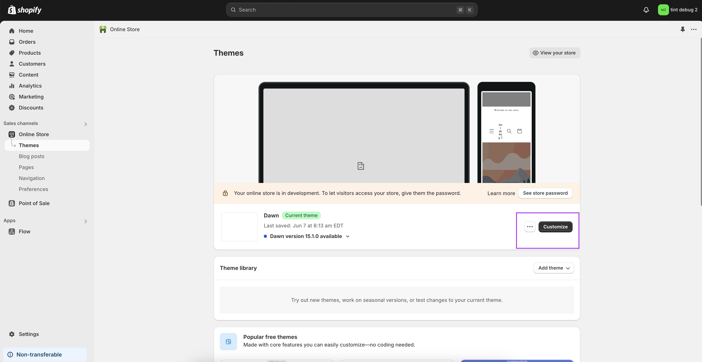
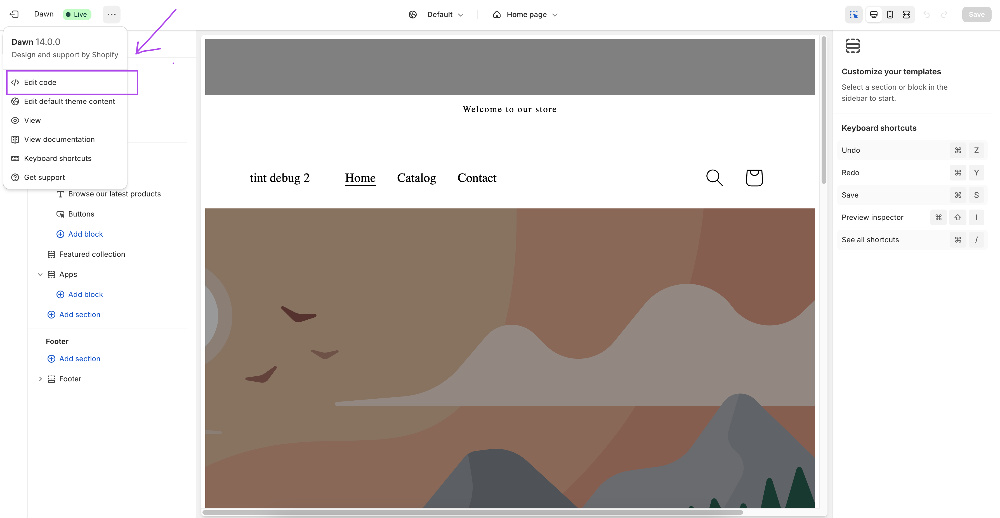
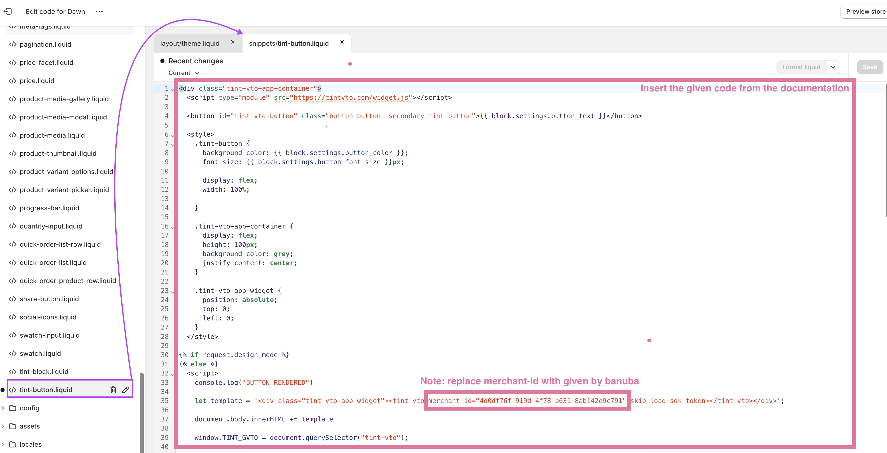

# Tint VTO App Integration with Shopify

This documentation provides step-by-step instructions for integrating the Tint VTO (Virtual Try-On) app widget with a Shopify store. The integration is split into 3 key steps:

1. **Create a New Liquid Template** - Briefly describe the creation of a new Liquid template for the widget.
2. **Integrate with the Main Theme** - Add the new template and script to the main Liquid theme.
3. **Test the Integration** - Ensure everything is working as expected.
## Merchant ID

Before starting, it's important to understand the role of the **Merchant ID**. The Merchant ID is a unique identifier assigned to your store that must be inserted into both the Liquid template and the JavaScript integration.  Merchant ID can be acessed through customer support or sales manager. 

Replace the placeholders (your-merchant-id) with your actual Merchant ID in the appropriate sections in javascript script.

```javascript
  let template = '<div class="tint-vto-app-widget"><tint-vto merchant-id="your-merchant-id" skip-load-sdk-token></tint-vto></div>';
```
## Step 1: Create a New Liquid Template

### Add the HTML and JavaScript Code to Your Theme

1. Open your Shopify store’s admin page.
2. Navigate to **Themes** and click **Customize Theme** 
3. Click **Edit Code** 
4. Create a new template that includes the button, widget initialization, and cart integration script 

**Code snippet for template**

```html
<div class="tint-vto-app-container">
  <script type="module" src="https://dev.tintvto.com/widget.js"></script>
  <button id="tint-vto-button" class="button button--secondary tint-button">{{ block.settings.button_text }}</button>
  <style>
    .tint-button {
      background-color: {{ block.settings.button_color }};
      font-size: {{ block.settings.button_font_size }}px;
      display: flex;
      width: 100%;
    }
    .tint-vto-app-container {
      display: flex;
      justify-content: center;
    }
    .tint-vto-app-widget {
      position: absolute;
      top: 0;
      left: 0;
    }
  </style>


  <script>
    let template = '<div class="tint-vto-app-widget"><tint-vto merchant-id="{{ app.metafields.settings.merchantId }}" skip-load-sdk-token></tint-vto></div>';
    document.body.innerHTML += template
    window.TINT_GVTO = document.querySelector("tint-vto");
    const widget = document.querySelector("tint-vto");
    widget.addEventListener("addToCart", ({detail}) => {
      Promise.all(detail.map((tintProduct) => {
        console.log('addToCart: ', tintProduct);
        const productSKU = tintProduct.swatches[0].sku;
        console.log('productSKU:', productSKU);
        const productName = tintProduct.name.toLowerCase().replaceAll(' ', '-');
        return fetch(`${window.Shopify.routes.root}products/${productName}.js`)
          .then(r => r.json())
          .then((shopifyProduct) => shopifyProduct.variants[0].id)
        ;
      })).then((shopifyItemsIdList) => {
        const cartData = {
          items: shopifyItemsIdList.map((id) => ({ id, quantity: 1 })),
        };
        fetch(`${window.Shopify.routes.root}cart/add.js`, {
          body: JSON.stringify(cartData),
          headers: {
            'Content-Type': 'application/json',
          },
          method: 'POST',
        }).then(r => r.json()).then((data) => console.log('Products added', data));
      });
    });
    widget.addEventListener("redirectToCart", ({detail}) => {
      widget.close();
      window.location.href = "/cart/";
    })
    widget.addEventListener("removeFromCart", ({detail}) => {
      Promise.all(detail.map((tintProduct) => {
        const productName = tintProduct.name.toLowerCase().replaceAll(' ', '-');
        return fetch(`${window.Shopify.routes.root}products/${productName}.js`)
                .then(r => r.json())
                .then((shopifyProduct) => shopifyProduct.variants[0].id)
                ;
      })).then((shopifyItemsIdList) => {
        const cartData = {
          updates: shopifyItemsIdList.reduce((acc, id) => ({
            ...acc,
            [id]: 0,
          }), {}),
        };
        fetch(`${window.Shopify.routes.root}cart/update.js`, {
          body: JSON.stringify(cartData),
          headers: {
            'Content-Type': 'application/json',
          },
          method: 'POST',
        }).then(r => r.json()).then((data) => console.log('Products removed', data));
      });
    });
    document.getElementById("tint-vto-button").addEventListener("click", async () => {
      await widget.open();
      await widget.useWebcam();
      
      const sku = "{{ block.settings.product.variants[0].sku }}";
      widget.applyProductByCustomerSku([sku]);
      
    });
  </script>

</div>
```

**How Adding to Cart Works**

1. **addToCart Event**: This event triggers when a product is added to the cart via the widget.
2. **redirectToCart Event**: Redirects users to the cart page.
3. **removeFromCart Event**: Handles product removal from the cart.
## Step 2: Integrate the New Template with the Main Theme

Add the newly created template and script to the appropriate Liquid file (e.g., product.liquid or cart.liquid) in your Shopify theme, as shown in picture. This will define where the Tint VTO button appears on your store pages
![[pic4.png]]
## Step 3 Test the Integration

• **Check the SKU**: **Verify the SKU**: Make sure that the SKU used in your Tint VTO widget (the SKU provided for digitalization to the TINT team) matches the SKU in your Shopify store.
• **Open the Widget**: Refresh your Shopify store page and click the button to open the widget.
• **Verify Cart Addition**: After clicking “Add to Cart,” check that the product has been successfully added to the Shopify cart.